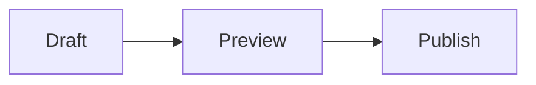

# Apollo

A minimal, high-performance Jekyll theme for personal websites and blogs. Designed for readability and elegance.

## Features

- 🎨 **Two Beautiful Themes**: Choose between **Paper** (Clean Ivory/Slate) and **Flexoki** (Warm Earthy).
- 📱 **Responsive & Mobile-First**: Optimized layout for all devices.
- 🌙 **Dark Mode Support**: Automatic and manual toggle.
- ✍️ **Typography Focused**: Optimized for long-form reading.
- 🎯 **Code Block UX**: Rouge highlighting, language labels, diff styling, and copy buttons.
- 🖼️ **Figure Helpers**: Captioned images with lazy loading, wide layouts, and SEO-aware hero/social image metadata.
- 🧮 **Opt-in Math & Diagrams**: Per-page MathJax and Mermaid support.
- 🔍 **SEO Optimized**: Built-in metadata, canonical URLs, and social preview tags.
- 📡 **Atom Feed Support**: Ships with visible collection feeds plus an aggregate root feed.

---

## Themes

Apollo comes with two pre-configured color themes. The default is **Paper**.

### Switching Themes

To switch to **Flexoki**, edit `assets/css/styles.scss`:

```scss
// @use "themes/paper";      <-- Comment this out
@use "themes/flexoki";    // <-- Uncomment this
```

---

## Quick Start (Template Development)

For working on Apollo itself:

```bash
# Prerequisites
brew install fswatch           # File watcher for live reload
brew install vips              # Image processing for OG images
bundle install                 # Ruby dependencies

# Run locally
bash scripts/compose.sh serve
```

Open http://localhost:4000 - edits to `_sass/`, `_layouts/`, etc. auto-reload.

---

## Use Apollo for Your Site

### Step 1: Create Your Site Repo

```bash
mkdir my-site && cd my-site
git init
```

### Step 2: Add Apollo as a Subtree

```bash
git remote add apollo https://github.com/defaults/apollo.git
git fetch apollo
git subtree add --prefix=apollo apollo master --squash
```

### Step 3: Run Setup Script

```bash
bash apollo/scripts/setup-site.sh
```

This creates:
```
my-site/
├── apollo/               # Theme (git subtree - don't edit directly)
├── content/              # Your markdown files (edit this!)
│   ├── _essays/          # Blog posts
│   ├── home/index.md     # Homepage
│   └── about.md          # About page
├── overrides/            # Optional theme overrides
├── scripts/
│   └── compose.sh        # Build script (delegates to apollo)
├── _config.local.yml     # Your site config
├── app.yaml              # GCP App Engine config
└── .github/workflows/
    └── deploy.yml        # CI/CD workflow
```

### Step 4: Configure Your Site

Edit `_config.local.yml`:

```yaml
title: "Your Name"
description: "Your tagline"
url: "https://yoursite.com"
author:
  name: "Your Name"

# SEO & Social
twitter:
  username: "yourhandle"
social:
  links:
    - https://twitter.com/yourhandle
    - https://github.com/yourhandle
```

### Step 5: SEO & LLM Optimization

- **SEO**: Handled automatically by `jekyll-seo-tag`. Ensure `title`, `description`, `url`, and `logo` are set in `_config.local.yml`. `url` must be the production origin, such as `https://example.com`, so canonical URLs and social images are absolute.
- **Feeds**: `/feed.xml` is the aggregate Atom feed. Collection feeds are configured under `feed.collections` and default to `/essays/feed.xml`. List pages show a visible RSS link when their collection has a feed.
- **LLM SEO**: A `/llms.txt` file is automatically generated for AI indexing.

### Step 6: Add Your Content

Edit files in `content/`:

```markdown
# content/_essays/2024-01-01-my-first-post.md
---
title: "My First Post"
date: 2024-01-01
---

Write your content here in markdown.
```

### Rich Markdown Helpers

Apollo keeps normal Markdown as the default, then adds a few optional helpers for technical writing.

#### Code Blocks

Fenced code blocks are enhanced automatically with a language label and copy button:

````markdown
```typescript
const message = "hello";
```
````

Diff blocks receive inserted/deleted line styling:

````markdown
```diff
- const theme = "light";
+ const theme = userPreference ?? "light";
```
````

#### Figures

Use the figure include when you want captions, dimensions, or wide/full layouts:

```liquid

```

For post hero images, use `hero` in front matter:

```yaml
title: "My Essay"
description: "A concise summary for search and social previews."
date: 2024-01-01
hero:
  image: /assets/images/example.png
  alt: A readable description
  caption: Optional hero caption.
social_image: /assets/images/og/example.png
```

`social_image` is used for SEO/share metadata. Use a `1200x630` image for the most reliable large-card rendering on social sites. If `social_image` is omitted, Apollo falls back to the hero image, then the first image in the page, then `logo`.

### Publishing Validation

Run the publishing check before deploying or after changing metadata/feed behavior:

```bash
bash scripts/validate-publishing.sh
```

For a consumer site that vendors Apollo under `apollo/`, run:

```bash
bash apollo/scripts/validate-publishing.sh
```

The validator stages the site, runs Jekyll, then checks generated output for `/feed.xml`, `/essays/feed.xml`, feed discovery links, canonical URLs, Open Graph/Twitter images, `/robots.txt`, `/sitemap.xml`, and `/llms.txt`. It requires `vips` and the Ruby bundle to be installed first:

```bash
brew install vips
BUNDLE_GEMFILE=apollo/Gemfile bundle install
```

#### Math and Mermaid

Enable math or diagrams per page:

```yaml
math: true
mermaid: true
```

Then write regular display math or Mermaid fences:

````markdown
$$ E = mc^2 $$


````

### Step 7: Run Locally

```bash
# Install dependencies (once)
BUNDLE_GEMFILE=apollo/Gemfile bundle install
brew install fswatch

# Serve with live reload
bash scripts/compose.sh serve
```

Open http://localhost:4000

### Step 8: Deploy

Push to GitHub. The included workflow deploys to GCP App Engine.

Required secret: `GCP_SERVICE_ACCOUNT_KEY` (your GCP service account JSON)

---

## Updating the Theme

```bash
git fetch apollo
git subtree pull --prefix=apollo apollo master --squash
```

---

## Customization

### Override Theme Files

Copy any file from `apollo/` to `overrides/` with the same path and modify it:

```bash
# Example: customize the header
cp apollo/_includes/header.html overrides/_includes/header.html
# Edit overrides/_includes/header.html
```

### CSS Variables

The theme uses CSS custom properties. Override in `overrides/assets/css/custom.scss`:

```scss
:root {
  --color-action: #your-color;
}
```

---

## Project Structure

| Directory | Purpose | Edit? |
|-----------|---------|-------|
| `apollo/` | Theme (subtree) | ❌ No |
| `content/` | Your markdown | ✅ Yes |
| `overrides/` | Theme overrides | ✅ Yes |
| `_config.local.yml` | Site config | ✅ Yes |

---

## Commands

| Command | Description |
|---------|-------------|
| `bash scripts/compose.sh serve` | Build and serve with live reload |
| `bash scripts/compose.sh build` | Build site (for CI/manual builds) |
| `bash scripts/compose.sh clean` | Remove build directory |

---

## License

MIT
