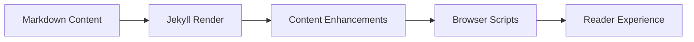

This essay is intentionally practical: it gives the example site one page that touches the rich content helpers Apollo adds on top of regular Markdown.

## Hero and Social Images

The front matter for this page sets both `hero.image` and `social_image`. The essay layout should render the hero image above this content, while SEO/social metadata should use the explicit `social_image` value.

## Figures

Inline figures use the `figure.html` include. The default layout stays within the text measure and lazy-loads the image.



The same include can opt into a wide layout when an image benefits from more horizontal space.



## Code Blocks

Language labels and copy buttons are added after render. This TypeScript block should display a `TypeScript` label.

```typescript
type FeatureFlag = {
  key: 'math' | 'mermaid' | 'figures' | 'codeCopy';
  enabled: boolean;
};

const enabled = (features: FeatureFlag[]) => {
  return features.filter((feature) => feature.enabled).map((feature) => feature.key);
};

console.log(enabled([
  { key: 'math', enabled: true },
  { key: 'mermaid', enabled: true },
  { key: 'figures', enabled: true },
  { key: 'codeCopy', enabled: true }
]));
```

Diff fences should highlight inserted and deleted lines.

```diff
- image: /assets/images/og/essays/welcome.png
+ hero:
+   image: /assets/images/essays/welcome-demo.png
+   alt: A readable description
+ social_image: /assets/images/og/essays/welcome.png
```

## Mermaid

With `mermaid: true`, Mermaid fences are converted from highlighted code into a diagram container and rendered by the client-side Mermaid bundle.



## Math

With `math: true`, MathJax renders inline expressions like $a^2 + b^2 = c^2$ and display equations:

$$
\operatorname{score}(page) = \frac{readability + media + metadata}{3}
$$

## Expected Result

When this page is built locally, it should show a hero image with a caption, two captioned figures, copyable code blocks with labels, highlighted diff lines, a rendered Mermaid diagram, and rendered math.
