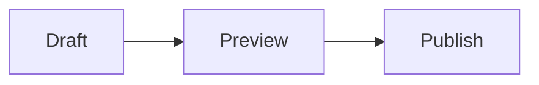

This post demonstrates the technical capabilities of the Apollo theme, including syntax highlighting for various languages and mathematical rendering.

## Syntax Highlighting

Apollo supports syntax highlighting for over 100 languages. Code blocks adapt to both light and dark modes automatically.

### Python

```python
def fibonacci(n):
    if n <= 1:
        return n
    else:
        return fibonacci(n-1) + fibonacci(n-2)

print([fibonacci(i) for i in range(10)])
# Output: [0, 1, 1, 2, 3, 5, 8, 13, 21, 34]
```

### TypeScript / JavaScript

```typescript
interface User {
  id: number;
  name: string;
  role: 'admin' | 'user';
}

const greet = (user: User): string => {
  return `Hello, ${user.name}!`;
};

const admin: User = { id: 1, name: "Apollo", role: "admin" };
console.log(greet(admin));
```

### Rust

```rust
fn main() {
    let greetings = ["Hello", "Hola", "Bonjour"];

    for greeting in greetings.iter() {
        println!("{}, world!", greeting);
    }
}
```

### Diff

```diff
- const theme = "light";
+ const theme = userPreference ?? "light";
```

## Diagrams



## Mathematical Notation

You can include math equations using LaTeX syntax by setting `math: true` in front matter.

$$ E = mc^2 $$

## Lists and Formatting

*   Unordered lists are clean and spacious.
*   They support **bold** and *italic* text.
    *   And nested items.

1.  Ordered lists are also supported.
2.  Perfect for tutorials or step-by-step guides.

---

The theme handles all standard Markdown elements gracefully, ensuring your technical content is as readable as your prose.
